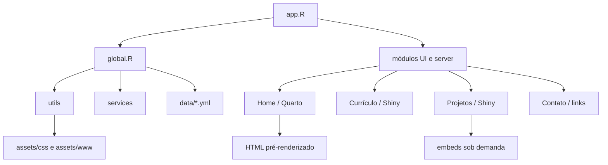

# Marco Leal Portfolio

Portfólio profissional desenvolvido em **R, Shiny, HTML e CSS** para apresentar a trajetória de Marco Aurélio Valles Leal em Estatística, Data Analytics, Business Intelligence, Data Science e Data Engineering.

O projeto foi estruturado como uma aplicação web orientada a recrutadores: o visitante consegue consultar rapidamente o perfil, a experiência profissional, as competências, os projetos, as certificações, os materiais de apoio e os canais profissionais de contato.

## Objetivo do projeto

O objetivo é transformar informações profissionais e resultados de projetos em uma experiência digital clara, navegável e visualmente consistente. A aplicação funciona como:

- portfólio profissional e marca pessoal;
- currículo interativo baseado em dados;
- catálogo de projetos de Analytics, BI, automação e Engenharia de Dados;
- demonstração prática de desenvolvimento em R e Shiny;
- espaço para apresentar dashboards, aplicações web, pipelines e soluções orientadas a decisão.

O conteúdo é mantido em arquivos YAML para separar dados e apresentação. Assim, experiências, projetos, formação e certificações podem ser atualizados sem reescrever toda a interface.

## Aplicação

A aplicação principal é composta pelas seguintes áreas:

- **Perfil**: página inicial com apresentação profissional pré-renderizada em Quarto e exibida em um iframe interno.
- **Currículo**: timeline de experiências e formação, competências, certificações, contatos e resumo profissional.
- **Projetos**: catálogo com pesquisa, navegação por abas e demos incorporadas abaixo dos detalhes de cada projeto.
- **Contato**: links para GitHub e LinkedIn. O antigo fluxo de envio de e-mail foi removido por não possuir formulário ativo.

As demonstrações dos projetos são carregadas sob demanda. O iframe recebe a URL somente quando o projeto é selecionado, evitando que várias páginas externas sejam abertas ou carregadas ao acessar a aba Projetos.

## Arquitetura

A arquitetura combina uma camada de apresentação em Shiny, uma camada de conteúdo orientada a dados e uma camada de recursos estáticos e integrações. Essa divisão foi escolhida para manter o portfólio fácil de atualizar, reutilizar e publicar.



### Por que essa arquitetura?

- **`app.R` como ponto de composição**: concentra a entrada da aplicação e a navegação principal, deixando cada área com uma responsabilidade clara.
- **`global.R` como inicialização compartilhada**: registra assets, carrega bibliotecas, configura o tema, disponibiliza dados em cache e importa os módulos na ordem necessária.
- **Módulos separados em `ui.R` e `server.R`**: isolam a interface da lógica reativa. Isso facilita manutenção, testes futuros e evolução independente das abas.
- **YAML como fonte de conteúdo**: separa dados profissionais da apresentação. Alterações no currículo não exigem mudanças na estrutura da aplicação.
- **Serviços isolados**: leitura de projetos e integração com a API do GitHub ficam fora dos módulos visuais, reduzindo acoplamento e centralizando tratamento de erros.
- **Componentes reutilizáveis**: cards, badges, KPIs e tokens de tema são definidos em `utils/`, evitando cópia de marcação e mantendo consistência visual.
- **Quarto para a página inicial**: permite uma apresentação editorial rica e pré-renderizada, enquanto o Shiny permanece responsável pela navegação e pelas áreas interativas.
- **Embeds sob demanda**: as demonstrações são exibidas abaixo dos projetos, mas só são carregadas quando a aba correspondente é selecionada. Isso reduz requisições externas e evita a abertura automática de páginas.
- **Assets estáticos servidos pelo Shiny**: imagens, PDFs, CSS e cases HTML permanecem versionados no projeto e são expostos por caminhos previsíveis.

### Fluxo de dados

1. `app.R` chama `global.R` ao iniciar.
2. `global.R` registra os caminhos públicos, carrega os helpers e lê os dados YAML com cache.
3. Os módulos recebem o identificador da aba e montam suas interfaces com `NS()`.
4. Os servidores dos módulos consultam os dados reativos e renderizam apenas os componentes necessários.
5. A aba Projetos cria os detalhes e os embeds; o JavaScript ativa o `src` apenas para o projeto selecionado.
6. Links externos, documentos e páginas de cases são abertos somente por ação explícita do visitante.

## Tecnologias utilizadas

### Linguagem e framework

- **R**: leitura e transformação de dados, regras de negócio, composição da interface e renderização reativa;
- **Shiny**: aplicação web reativa, módulos UI/server, navegação, filtros e renderização dinâmica;
- **bslib**: navbar, tema e integração com o sistema visual do Shiny;
- **HTML**: estrutura semântica das páginas, links, imagens, iframes, timelines e componentes gerados pelo Shiny;
- **CSS**: layout responsivo, tokens visuais, tipografia, grids, cards, timelines e estados de interação;
- **JavaScript**: navegação suave, botão voltar ao topo e ativação sob demanda dos embeds de projetos.

### Dados e conteúdo

- **YAML**: fonte principal dos dados do currículo e dos projetos;
- **Quarto**: geração da página inicial pré-renderizada;
- **R Markdown/knitr/Pandoc/LaTeX**: suporte aos materiais e à geração opcional do currículo em PDF.

### Integrações e suporte

- **GitHub API** com `httr2`, `jsonlite` e cache via `memoise`;
- **tibble**: criação das tabelas normalizadas de projetos;
- **Google Fonts** para tipografia da aplicação;
- **Arquivos HTML, PDF, JPG e PNG** para demonstrações, currículo, foto e identidade visual.

## Competências demonstradas

Este repositório demonstra o uso integrado de **R, Shiny e HTML** em um projeto de Data Visualization e comunicação analítica.

### R

- leitura segura e cacheada de dados YAML;
- construção de funções reutilizáveis para componentes de interface;
- normalização de projetos e geração de identificadores únicos;
- tratamento de datas para exibição em timelines;
- filtros reativos por texto;
- integração com serviços externos;
- tratamento de erros em chamadas de API;
- organização modular entre UI e server.

### Shiny

- composição de uma aplicação com `page_navbar`;
- módulos independentes com `NS`, `moduleServer`, `renderUI` e reatividade;
- renderização de timelines, listas, cards e indicadores;
- navegação por abas e filtros de projetos;
- carregamento controlado de conteúdo externo;
- separação entre dados, componentes e regras de apresentação.

### HTML, CSS e JavaScript

- criação de layouts responsivos e acessíveis;
- uso de links externos com `target="_blank"` e `rel="noopener noreferrer"` quando aplicável;
- incorporação de demos por iframe;
- lazy loading controlado dos embeds para reduzir carregamentos desnecessários;
- uso de classes semânticas para cards, timelines, grids e seções;
- adaptação para desktop e dispositivos móveis.

### Data Visualization e comunicação

O projeto utiliza princípios de visualização e comunicação de dados para organizar informação profissional em estruturas de leitura rápida, como:

- indicadores de impacto;
- timelines de experiência e formação;
- cards de projetos e competências;
- navegação por categorias;
- links para dashboards e aplicações analíticas;
- organização de resultados técnicos em linguagem orientada ao negócio.

## Estrutura do projeto

```text
.
├── app.R                         # Entrada da aplicação e navbar principal
├── global.R                      # Bibliotecas, tema, cache, dados e módulos
├── data/                         # Dados do currículo e catálogos em YAML
├── modules/
│   ├── home/                     # Página inicial Quarto e artefatos renderizados
│   ├── resume/                   # Currículo interativo e documentos de apoio
│   ├── projects/                 # Catálogo, filtros e embeds de projetos
│   ├── blog/                     # Estrutura futura de publicações
│   └── contact/                  # Links profissionais
├── services/                    # Integrações externas e leitura de projetos
├── utils/                       # Helpers, componentes e tema
├── assets/
│   ├── css/                     # Folhas de estilo da aplicação
│   ├── sass/                    # Fontes SASS e variáveis visuais
│   └── www/                     # Imagens, PDFs e páginas de cases
└── rsconnect/                   # Metadados de publicação no shinyapps.io
```

## Fonte dos dados

O arquivo principal é `data/resume_full.yml`. Ele contém:

- nome e informações profissionais;
- resumo completo e resumo curto;
- competências e stack tecnológica;
- experiências profissionais com bullets hierárquicos;
- formação acadêmica;
- certificações;
- projetos, descrições, links, demos e indicador de destaque.

Outros arquivos YAML mantêm catálogos complementares:

- `data/projects.yml`;
- `data/education.yml`;
- `data/experience.yml`;
- `data/certifications.yml`.

O `resume_full.yml` é a fonte prioritária para o currículo e para a aba Projetos. Os IDs dos projetos são únicos e o servidor ainda aplica uma proteção com `make.unique()` para evitar conflitos de abas.

## Dependências

### Pacotes R

Instale os pacotes utilizados pelos scripts da aplicação:

```r
install.packages(c(
  "shiny",
  "bslib",
  "yaml",
  "fs",
  "memoise",
  "htmltools",
  "glue",
  "httr2",
  "jsonlite",
  "dplyr",
  "stringr",
  "tibble",
  "knitr"
))
```

### Ferramentas opcionais

As ferramentas abaixo são necessárias apenas para regenerar documentos derivados:

- **Quarto CLI** para renderizar os arquivos `.qmd`;
- **Pandoc**, normalmente instalado ou gerenciado pelo Quarto;
- **LaTeX/pdfLaTeX** para gerar o currículo PDF a partir de `Resume.Rmd`;
- pacote R **rsconnect** para publicação no shinyapps.io;
- navegador moderno com suporte a CSS Grid, `MutationObserver`, iframes e JavaScript.

## Como executar localmente

Abra o projeto no RStudio ou no VS Code com suporte a R e execute na raiz do repositório:

```r
shiny::runApp()
```

Ou execute:

```r
shiny::runApp(".")
```

O Shiny informará no console o endereço local, normalmente semelhante a `http://127.0.0.1:xxxx`.

## Como atualizar o conteúdo

1. Edite os dados em `data/resume_full.yml`.
2. Para adicionar um projeto, use um `id` exclusivo, um título, uma descrição e, quando disponível, uma URL em `demo`.
3. Para demos locais, mantenha o arquivo dentro de `assets/www/` e use o caminho relativo servido pela aplicação.
4. Para alterar a estrutura visual, edite o módulo correspondente em `modules/`.
5. Para alterar o tema global, edite `assets/css/app.css` e os tokens em `utils/theme.R`.

O conteúdo do `summary` usa blocos YAML dobrados (`summary: >`), permitindo organizar o texto em várias linhas no arquivo sem criar quebras artificiais na tela. A separação visual entre parágrafos é feita pelo renderer e pelo CSS.

## Segurança e configuração

- Arquivos locais de credenciais, como `.smtp_creds` e `.Renviron`, são ignorados pelo Git.
- Tokens e chaves de API devem ser fornecidos por variáveis de ambiente, nunca gravados no código.
- O fluxo de envio de e-mail foi removido; a aba Contato atualmente não depende de credenciais de e-mail.
- O consumo da GitHub API possui uma camada segura com tratamento de erros para evitar que uma falha externa encerre a sessão Shiny.
- Links externos devem ser revisados antes da publicação, especialmente demos hospedados fora do projeto.

## Evolução implementada

Durante a evolução do projeto foram implementadas as seguintes melhorias:

- criação da aplicação modular em Shiny;
- definição de tema escuro global e tokens visuais;
- reorganização das abas e do layout orientado a recrutadores;
- centralização do currículo em `resume_full.yml`;
- renderização dinâmica de experiências, formação, competências e certificações;
- suporte a três parágrafos no resumo profissional;
- preservação do conteúdo completo de `summary` sem quebras artificiais de linha;
- espaçamento visual entre parágrafos na seção Sobre;
- correção dos IDs duplicados dos projetos;
- geração defensiva de IDs únicos no servidor;
- inclusão de demos incorporadas abaixo dos detalhes dos projetos;
- carregamento sob demanda dos embeds para evitar abertura automática de páginas;
- correção de caminhos de demos locais;
- remoção do fluxo de contato incompleto e do helper de envio de e-mail;
- remoção de referências de credenciais do versionamento;
- documentação dos scripts R, UI, server, serviços e utilitários em português do Brasil;
- melhoria da responsividade para telas menores;
- inclusão de navegação por âncoras e botão voltar ao topo.

## Estado atual e próximos passos

O projeto está funcional como portfólio profissional e currículo web. As áreas que ainda podem evoluir são:

- adicionar testes automatizados para leitura YAML e renderização de dados;
- criar um `renv.lock` para fixar versões dos pacotes R;
- adicionar pipeline de validação e deploy contínuo;
- substituir o conteúdo provisório do Blog por uma fonte real de artigos;
- melhorar a validação visual dos links e demos externas;
- adicionar uma estratégia formal para publicação das páginas Quarto e dos documentos PDF.

## Publicação

O diretório `rsconnect/shinyapps.io/` contém metadados de publicação do projeto no shinyapps.io. Para publicar, configure as credenciais do serviço no ambiente local e utilize o fluxo de publicação do RStudio ou do pacote `rsconnect`.

Antes da publicação, revise:

- URLs de demos e redes sociais;
- existência das imagens e PDFs em `assets/www/`;
- disponibilidade de todas as dependências R;
- configuração das variáveis de ambiente;
- comportamento dos iframes em produção;
- compatibilidade dos caminhos relativos com o provedor de hospedagem.

## Autor

**Marco Aurélio Valles Leal**  
Estatístico | Data Analyst | Data Scientist | Business Intelligence | Data Engineering

- GitHub: <https://github.com/marco-leal-analytics>
- LinkedIn: <https://www.linkedin.com/in/marco-a-v-leal/>
- Portfólio: <https://marco-leal-analytics.shinyapps.io/marco-leal-portfolio/>
