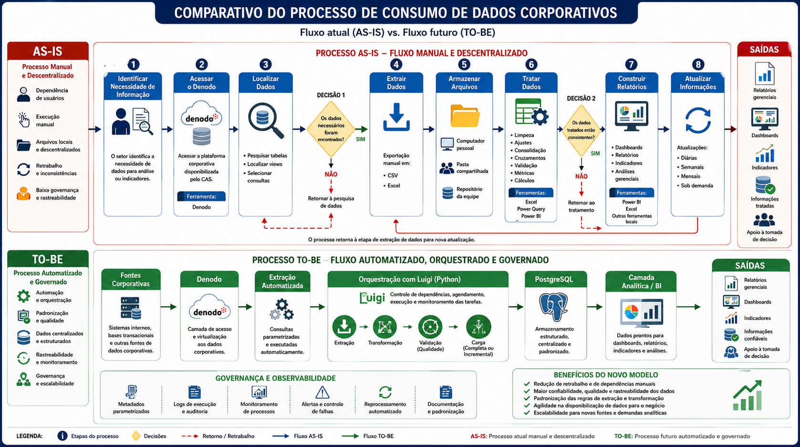

---
output:
  html_document:
    self_contained: true
    css: ../../../assets/css/app.css
---
    

# Engenharia de Dados e Modernização Analítica  
## Automação do Pipeline Corporativo Denodo → PostgreSQL

**Projeto:** Estruturação de pipeline corporativo de dados, automação de cargas e modernização do consumo analítico  
**Responsável técnico:** Marco Aurélio Valles Leal  
**Tecnologias:** Python, Luigi, PostgreSQL, SQL, Denodo, ETL/ELT, Metadata Driven Architecture e Business Intelligence  
**Contexto:** Sicredi Agroempresarial PR/SP

---

## Arquitetura AS-IS e TO-BE

A figura a seguir apresenta, de forma comparativa, a evolução do processo de consumo e disponibilização de dados corporativos, destacando o cenário operacional anterior (AS-IS) e a arquitetura automatizada implementada (TO-BE).




# 1. Visão Executiva

Este projeto teve como objetivo transformar um processo corporativo de obtenção, tratamento e disponibilização de dados que dependia fortemente de atividades manuais em uma **arquitetura de dados automatizada, parametrizada, governada e escalável**, estabelecendo um fluxo estruturado entre a plataforma corporativa Denodo e um ambiente PostgreSQL destinado ao consumo analítico.

A iniciativa surgiu a partir da identificação de um problema recorrente: embora os dados corporativos estivessem disponíveis na organização, sua utilização analítica dependia de uma sequência operacional descentralizada envolvendo acesso manual ao Denodo, localização individual de tabelas e views, execução de consultas, exportação de arquivos, armazenamento local, tratamento em ferramentas distintas e posterior construção ou atualização de relatórios e dashboards.

O processo anterior apresentava características típicas de um ambiente analítico em estágio de descentralização: **execução manual, dependência do conhecimento individual, múltiplas cópias de dados, retrabalho, arquivos locais, ausência de uma camada central de processamento e dificuldades de rastreabilidade e governança**.

A partir desse diagnóstico, foi concebido e implementado um pipeline corporativo utilizando **Python e Luigi como camada de orquestração**, com PostgreSQL como ambiente estruturado de persistência e uma arquitetura orientada por metadados para controlar parâmetros de extração, processamento, atualização e dependências.

A mudança não consistiu apenas na automatização de consultas. O projeto estabeleceu uma nova forma de operacionalizar o dado: o conhecimento anteriormente distribuído entre usuários, planilhas, arquivos e procedimentos manuais passou a ser incorporado a uma **estrutura técnica reutilizável e parametrizada**.

O resultado foi a evolução de um processo predominantemente operacional para uma **infraestrutura analítica capaz de suportar cargas recorrentes, padronização, validação, rastreabilidade, reprocessamento e expansão para novos conjuntos de dados**, criando uma base mais confiável para Business Intelligence, relatórios gerenciais, indicadores e análises corporativas.

---

# 2. Contexto Estratégico

Em ambientes corporativos, a disponibilidade de dados não representa, por si só, maturidade analítica.

Uma organização pode possuir sistemas transacionais, plataformas de integração e grande quantidade de dados corporativos e, ainda assim, enfrentar dificuldades para responder perguntas de negócio caso o caminho entre **dado bruto → informação tratada → indicador → decisão** seja excessivamente manual.

Esse era o principal desafio observado no processo analisado.

A plataforma Denodo disponibilizava acesso aos dados corporativos necessários às áreas de negócio. Entretanto, a utilização desses dados dependia de uma cadeia de atividades realizadas pelos próprios usuários ou analistas:

**necessidade de informação → acesso ao Denodo → localização dos dados → consulta → exportação → armazenamento → tratamento → construção do relatório → atualização recorrente.**

Essa estrutura funcionava para demandas pontuais, mas apresentava limitações quando submetida a um contexto de crescimento da demanda analítica, necessidade de atualizações frequentes e multiplicação de relatórios, indicadores e processos de consumo.

O projeto foi concebido, portanto, como uma iniciativa de **Engenharia de Dados aplicada à transformação do processo analítico**, buscando deslocar o esforço humano da execução repetitiva para atividades de maior valor agregado, como análise, interpretação dos resultados e suporte à tomada de decisão.

---

# 3. Modelo de Transformação

A lógica central do projeto pode ser representada pelo seguinte encadeamento:

```text
PROBLEMA
   ↓
Processo manual, descentralizado e dependente de usuários
   ↓
DADOS
   ↓
Fontes corporativas disponibilizadas pelo Denodo
   ↓
EVIDÊNCIA
   ↓
Retrabalho, arquivos locais, múltiplas solicitações e atualizações recorrentes
   ↓
ANÁLISE
   ↓
Identificação dos gargalos e das oportunidades de automação
   ↓
INSIGHT
   ↓
O problema estava principalmente no processo de consumo dos dados
   ↓
DECISÃO
   ↓
Construção de pipeline automatizado e orientado por metadados
   ↓
IMPACTO
   ↓
Dados mais confiáveis, rastreáveis, padronizados e disponíveis
para Business Intelligence e tomada de decisão
```

Essa estrutura evidencia que a transformação realizada foi simultaneamente **técnica, operacional e organizacional**.

---

# 4. Arquitetura AS-IS

A arquitetura AS-IS representa o processo existente antes da implementação do pipeline.

A imagem fornecida demonstra um fluxo de consumo de dados caracterizado pela sucessão de etapas manuais e pela necessidade de decisões intermediárias realizadas pelos usuários.

## 4.1 Fluxo geral do processo anterior

```text
Necessidade de informação
        ↓
Identificação da demanda
        ↓
Acesso manual ao Denodo
        ↓
Localização de tabelas / views
        ↓
Decisão: dados necessários foram encontrados?
        ├── NÃO → nova pesquisa
        └── SIM
              ↓
         Extração manual
              ↓
       CSV / Excel / arquivos
              ↓
        Armazenamento local
              ↓
     Tratamento e consolidação
              ↓
   Decisão: dados estão consistentes?
        ├── NÃO → retornar ao tratamento
        └── SIM
              ↓
      Relatórios / Dashboards
              ↓
       Atualizações recorrentes
              ↓
      Nova extração de dados
```

O próprio desenho evidencia características como **execução manual, self-service, descentralização por áreas, retrabalho, utilização de arquivos locais, atualizações recorrentes, ausência de governança analítica, duplicidade de esforços e dependência do conhecimento dos usuários**.

---

## 4.2 Etapa 1 — Identificação da necessidade de informação

O processo começava a partir de uma demanda de negócio.

As necessidades podiam estar relacionadas a:

- análises específicas;
- solicitação de indicadores;
- construção de relatórios;
- atualização de dashboards;
- acompanhamento gerencial;
- necessidade de novas informações;
- atualização de informações já utilizadas.

O primeiro problema estrutural aparecia nesse momento: o processo de obtenção do dado estava diretamente associado ao conhecimento de quem executaria a demanda.

O usuário precisava compreender:

- qual informação era necessária;
- onde provavelmente estava localizada;
- qual tabela ou view deveria ser consultada;
- quais campos deveriam ser utilizados;
- quais filtros deveriam ser aplicados;
- como o resultado deveria ser tratado posteriormente.

Assim, parte do conhecimento necessário para produzir a informação estava implicitamente armazenada na experiência individual dos usuários.

---

## 4.3 Etapa 2 — Acesso ao Denodo

A segunda etapa consistia no acesso à plataforma corporativa Denodo.

Embora a plataforma centralizasse o acesso a diferentes dados corporativos, o processo analítico ainda dependia da atuação manual para encontrar e consultar os objetos necessários.

Isso significava que a disponibilidade técnica do dado não correspondia necessariamente à sua disponibilidade operacional para consumo recorrente.

O acesso manual também aumentava a dependência de procedimentos conhecidos pelos usuários e dificultava a transformação de uma consulta analítica em uma rotina corporativa padronizada.

---

## 4.4 Etapa 3 — Localização dos dados

Após acessar o Denodo, o usuário precisava localizar as estruturas adequadas.

O processo envolvia atividades como:

- pesquisar tabelas;
- localizar views;
- selecionar consultas;
- identificar campos;
- interpretar estruturas;
- determinar quais objetos atendiam à necessidade analítica.

Esse estágio representava um dos principais pontos de dependência do conhecimento individual.

O mesmo problema poderia ser resolvido de maneiras diferentes por diferentes usuários, aumentando o risco de divergências metodológicas.

---

## 4.5 Decisão 1 — Os dados necessários foram encontrados?

O processo apresentava uma decisão explícita:

**Os dados necessários foram encontrados?**

Caso a resposta fosse negativa, o fluxo retornava para uma nova pesquisa.

Esse ciclo representa um mecanismo de retrabalho:

```text
Pesquisar
   ↓
Não encontrou
   ↓
Pesquisar novamente
   ↓
Testar outra tabela/view
   ↓
Reformular consulta
   ↓
Pesquisar novamente
```

Em processos recorrentes, esse tipo de atividade representa custo operacional que não necessariamente agrega valor analítico.

---

## 4.6 Etapa 4 — Extração dos dados

Quando os dados eram localizados, a extração era realizada manualmente.

A imagem evidencia exportações para formatos como:

- CSV;
- Excel.

Essa etapa transformava uma estrutura corporativa de dados em arquivos intermediários que passavam a circular pelo ambiente analítico.

Embora arquivos sejam recursos úteis em atividades exploratórias, seu uso como mecanismo recorrente de integração apresenta limitações relacionadas a:

- controle de versões;
- consistência;
- rastreabilidade;
- duplicidade;
- atualização;
- segurança;
- padronização;
- dependência do usuário responsável.

---

## 4.7 Etapa 5 — Armazenamento dos arquivos

Os arquivos extraídos eram armazenados em diferentes locais, incluindo:

- computadores pessoais;
- pastas compartilhadas;
- repositórios das equipes.

Esse modelo produzia uma arquitetura de dados distribuída informalmente.

Em vez de existir uma camada central estruturada para consumo analítico, diferentes versões dos dados poderiam coexistir em diferentes locais.

O resultado potencial era a existência de múltiplas "verdades operacionais" para um mesmo conjunto de informações.

---

## 4.8 Etapa 6 — Tratamento dos dados

Após a extração, os dados precisavam ser tratados.

O processo incluía atividades como:

- limpeza;
- ajustes;
- consolidação;
- cruzamentos;
- validação;
- aplicação de métricas;
- cálculos.

Ferramentas como Excel, Power Query e Power BI eram utilizadas nesse processo.

Esse modelo transferia parte relevante do processamento para a camada de consumo.

Como consequência, diferentes relatórios poderiam possuir tratamentos semelhantes, mas implementados de formas diferentes.

---

## 4.9 Decisão 2 — Os dados tratados estão consistentes?

Outra decisão importante era a validação da consistência.

Quando os dados não estavam consistentes, o fluxo retornava à etapa de tratamento.

```text
Tratamento
   ↓
Validação
   ↓
Inconsistência
   ↓
Novo tratamento
   ↓
Nova validação
```

Esse comportamento reforçava o caráter iterativo e manual do processo.

---

## 4.10 Etapa 7 — Construção dos produtos analíticos

Após o tratamento, os dados eram utilizados para construir:

- dashboards;
- relatórios;
- indicadores;
- análises gerenciais.

Essa etapa representava a entrega efetivamente percebida pelo negócio.

Entretanto, grande parte do esforço anterior estava concentrada na preparação do dado, e não na análise.

---

## 4.11 Etapa 8 — Atualização das informações

O processo precisava ser repetido para manter as informações atualizadas.

As atualizações podiam ocorrer:

- diariamente;
- semanalmente;
- mensalmente;
- sob demanda.

Isso significava que um relatório recorrente poderia exigir a repetição de grande parte do fluxo original.

```text
Novo período
    ↓
Acessar Denodo
    ↓
Localizar dados
    ↓
Executar consulta
    ↓
Exportar
    ↓
Salvar arquivo
    ↓
Tratar
    ↓
Validar
    ↓
Atualizar relatório
```

A repetição desse fluxo constituía um dos principais argumentos para automação.

---

# 5. Principais Limitações do AS-IS

A análise do processo evidenciou um conjunto de limitações estruturais.

### Execução manual

A execução dependia da atuação direta dos usuários em diversas etapas do processo.

### Dependência do conhecimento individual

O conhecimento sobre tabelas, views, consultas e regras de tratamento permanecia parcialmente concentrado nos usuários.

### Descentralização

Dados, arquivos e procedimentos podiam estar distribuídos entre diferentes computadores, pastas e equipes.

### Retrabalho

A atualização recorrente exigia repetição das mesmas atividades.

### Duplicidade de esforços

Diferentes áreas poderiam realizar processos semelhantes de forma independente.

### Arquivos intermediários

CSV e Excel funcionavam como mecanismos de transporte e processamento dos dados.

### Baixa rastreabilidade

Era mais difícil determinar de maneira sistemática:

- quando o dado havia sido extraído;
- qual consulta havia sido utilizada;
- qual transformação havia sido aplicada;
- quem havia realizado determinada alteração;
- qual versão estava sendo consumida.

### Ausência de governança analítica centralizada

As regras de transformação e atualização não estavam necessariamente concentradas em uma infraestrutura única.

### Risco operacional

Falhas humanas, alterações de arquivos, esquecimento de atualizações ou execução incorreta poderiam comprometer o processo.

### Escalabilidade limitada

A expansão da quantidade de tabelas, relatórios e demandas aumentava proporcionalmente a carga operacional.

---

# 6. Problema

O problema central identificado não era a inexistência dos dados.

Os dados corporativos estavam disponíveis por meio do ecossistema de informações acessado pelo Denodo.

O problema estava na **forma como esses dados eram transformados em informação analítica recorrente**.

O fluxo anterior exigia que usuários atuassem simultaneamente como:

- consumidores de dados;
- localizadores de fontes;
- executores de consultas;
- operadores de extração;
- responsáveis por arquivos;
- desenvolvedores de tratamentos;
- validadores;
- atualizadores de relatórios.

Esse desenho gerava uma concentração excessiva de atividades operacionais na cadeia analítica.

Em termos executivos, o principal desafio era:

> **Como transformar um processo dependente de execução manual e conhecimento individual em uma capacidade corporativa de dados automatizada, reutilizável, rastreável e escalável?**

---

# 7. Dados

Os dados utilizados pelo projeto eram provenientes de fontes corporativas disponibilizadas através da plataforma Denodo.

O Denodo atuava como camada de acesso e virtualização aos dados necessários às análises das áreas de negócio.

O pipeline passou a estruturar o consumo desses dados de forma automatizada, permitindo estabelecer um fluxo controlado entre:

```text
Fontes corporativas
       ↓
Denodo
       ↓
Consultas parametrizadas
       ↓
Extração automatizada
       ↓
Processamento Python / SQL
       ↓
Validação
       ↓
PostgreSQL
       ↓
Camada analítica
       ↓
BI / Relatórios / Indicadores / Análises
```

A utilização do PostgreSQL como camada estruturada de persistência permitiu retirar parte relevante do processamento recorrente dos arquivos locais e aproximar o dado tratado de uma arquitetura corporativa de consumo.

---

# 8. Evidência

Diversos sinais indicavam que o modelo existente havia atingido um nível em que a automação se tornava necessária.

Entre os principais sinais estavam:

- crescimento das demandas analíticas;
- necessidade de atualização recorrente das informações;
- repetição das mesmas consultas;
- recorrência de tratamentos semelhantes;
- necessidade de exportações frequentes;
- utilização de arquivos intermediários;
- múltiplos consumidores;
- diferentes necessidades de atualização;
- necessidade de maior consistência;
- dificuldade de rastrear processos executados manualmente;
- dependência da disponibilidade dos usuários;
- possibilidade de divergência entre versões dos dados;
- aumento da complexidade para manutenção dos processos.

A evidência mais importante era a relação entre **recorrência e esforço**.

Quanto mais recorrente fosse uma demanda, menos justificável se tornava sua execução manual.

---

# 9. Análise

A análise do fluxo AS-IS demonstrou que o processo apresentava um padrão clássico de oportunidade de automação:

```text
Alta recorrência
+
Baixa complexidade operacional
+
Regras relativamente estruturadas
+
Necessidade de repetição
+
Dependência humana
=
Alta oportunidade de automação
```

O levantamento permitiu identificar quatro grandes categorias de gargalos.

## 9.1 Gargalos de aquisição

A obtenção dos dados dependia de acessos manuais e da localização dos objetos adequados no Denodo.

## 9.2 Gargalos de processamento

Os dados eram tratados após a extração, frequentemente em ferramentas de consumo ou arquivos intermediários.

## 9.3 Gargalos de operação

A atualização dependia de pessoas, disponibilidade, conhecimento e execução correta das etapas.

## 9.4 Gargalos de governança

Não havia uma camada centralizada suficientemente estruturada para controlar todas as características das cargas.

A partir dessa análise, concluiu-se que a solução deveria atacar o processo em sua origem, e não apenas automatizar a atualização de um relatório específico.

---

# 10. Insight

O principal insight estratégico do projeto foi:

> **A principal limitação não estava na disponibilidade dos dados, mas na arquitetura operacional utilizada para transformar dados disponíveis em informação analítica confiável e recorrente.**

Essa conclusão alterou a natureza da solução.

Em vez de desenvolver automações isoladas para cada relatório, a estratégia passou a ser a criação de uma **infraestrutura reutilizável de dados**.

O objetivo deixou de ser:

**"automatizar um relatório"**

e passou a ser:

**"automatizar a cadeia de dados que alimenta diversos produtos analíticos."**

Essa mudança representa uma evolução importante de maturidade.

---

# 11. Decisão

A decisão arquitetural foi estabelecer um pipeline corporativo baseado em:

1. **Python** para desenvolvimento da lógica de processamento;
2. **Luigi** para orquestração das tarefas;
3. **Denodo** como camada de acesso às fontes corporativas;
4. **Metadados** como mecanismo de parametrização;
5. **SQL** para consulta e manipulação dos dados;
6. **PostgreSQL** como ambiente estruturado de armazenamento;
7. **Logs** para rastreabilidade operacional;
8. **Validações** para controle de qualidade;
9. **Cargas completas e incrementais** conforme a natureza do conjunto de dados;
10. **Dependências entre tarefas** para garantir a sequência correta de processamento;
11. **Processos reutilizáveis** para permitir expansão sem duplicação de código.

A arquitetura TO-BE passou, portanto, a funcionar como uma infraestrutura de dados e não como uma coleção de scripts independentes.

---

# 12. Arquitetura TO-BE

A arquitetura implementada pode ser representada conceitualmente da seguinte forma:

```text
                    ┌──────────────────────────┐
                    │      FONTES CORPORATIVAS │
                    └────────────┬─────────────┘
                                 │
                                 ▼
                    ┌──────────────────────────┐
                    │          DENODO          │
                    │ Camada de acesso aos     │
                    │ dados corporativos       │
                    └────────────┬─────────────┘
                                 │
                                 ▼
                    ┌──────────────────────────┐
                    │       METADADOS           │
                    │ Tabelas                   │
                    │ Consultas                 │
                    │ Parâmetros                │
                    │ Periodicidade             │
                    │ Destino                    │
                    │ Estratégia de carga        │
                    │ Dependências               │
                    └────────────┬─────────────┘
                                 │
                                 ▼
                    ┌──────────────────────────┐
                    │       ORQUESTRADOR        │
                    │       Python + Luigi      │
                    └────────────┬─────────────┘
                                 │
                  ┌──────────────┼──────────────┐
                  ▼              ▼              ▼
             Extração       Tratamento       Validação
                  │              │              │
                  └──────────────┼──────────────┘
                                 ▼
                    ┌──────────────────────────┐
                    │       PostgreSQL         │
                    │ Dados estruturados       │
                    │ Camada centralizada      │
                    └────────────┬─────────────┘
                                 │
                                 ▼
                    ┌──────────────────────────┐
                    │    CAMADA ANALÍTICA       │
                    │ BI / Relatórios / KPIs   │
                    │ Dashboards / Análises     │
                    └────────────┬─────────────┘
                                 │
                                 ▼
                    ┌──────────────────────────┐
                    │     DECISÃO DE NEGÓCIO    │
                    └──────────────────────────┘
```

---

# 13. Camadas da Solução

## 13.1 Camada de Origem

O Denodo concentrava o acesso às estruturas corporativas utilizadas pelas análises.

A solução não dependia da criação de uma lógica de conexão e consulta específica para cada conjunto de dados. O pipeline abstraía essa complexidade por meio de parâmetros e metadados.

---

## 13.2 Camada de Metadados

A camada de metadados constituía um dos elementos arquiteturais mais relevantes do projeto.

Em vez de codificar individualmente cada fluxo, as características do processamento eram representadas como parâmetros.

Conceitualmente:

```text
METADADO
│
├── Identificação da tabela
├── Identificação da consulta
├── Fonte
├── Destino
├── Chave de negócio
├── Estratégia de carga
├── Periodicidade
├── Parâmetros
├── Campos
├── Regras de atualização
├── Dependências
└── Status / controle
```

Dessa forma, o código do pipeline podia permanecer genérico enquanto os metadados definiam o comportamento específico de cada carga.

---

# 14. Arquitetura Orientada por Metadados

A arquitetura orientada por metadados pode ser entendida como uma separação entre:

**motor de processamento**

e

**configuração do processamento.**

Em uma arquitetura tradicional, cada nova tabela poderia exigir um novo script:

```text
Tabela A → Script A
Tabela B → Script B
Tabela C → Script C
Tabela D → Script D
```

Isso cria duplicação de código.

Na arquitetura implementada, a lógica passa a ser:

```text
             ┌────────────────────┐
             │  MOTOR GENÉRICO    │
             │ Python + Luigi      │
             └─────────┬──────────┘
                       │
              lê os metadados
                       │
        ┌──────────────┼──────────────┐
        ▼              ▼              ▼
   Metadado A      Metadado B     Metadado C
        │              │              │
        ▼              ▼              ▼
     Tabela A       Tabela B       Tabela C
```

Isso produz uma característica fundamental:

> **novos fluxos podem ser incorporados predominantemente por configuração, e não pela criação de uma nova implementação estrutural.**

---

# 15. Funcionamento da Parametrização

Um fluxo conceitual de execução pode ser representado assim:

```text
1. Luigi inicia a tarefa
          ↓
2. Identifica o processo solicitado
          ↓
3. Consulta os metadados
          ↓
4. Obtém fonte e consulta
          ↓
5. Obtém estratégia de carga
          ↓
6. Obtém parâmetros
          ↓
7. Verifica dependências
          ↓
8. Executa extração
          ↓
9. Executa tratamentos
          ↓
10. Executa validações
          ↓
11. Persiste no PostgreSQL
          ↓
12. Registra execução
          ↓
13. Libera tarefas dependentes
```

O mecanismo permite que o mesmo componente de software seja reutilizado para diferentes conjuntos de dados.

---

# 16. Orquestração com Luigi

O Luigi foi utilizado como camada de orquestração do pipeline.

Seu papel era controlar o fluxo de execução e as dependências entre tarefas.

Conceitualmente:

```text
Task A — Extração
      ↓
Task B — Tratamento
      ↓
Task C — Validação
      ↓
Task D — Carga PostgreSQL
      ↓
Task E — Disponibilização
```

Quando existem dependências:

```text
                 ┌── Task B1 ──┐
Task A ──────────┤             ├── Task D
                 └── Task B2 ──┘
```

A orquestração permite evitar a execução desordenada de processos.

Isso é especialmente relevante quando uma tabela depende de outra, quando uma etapa precisa ser concluída antes da seguinte ou quando diferentes cargas precisam obedecer a uma sequência operacional.

---

# 17. Controle de Dependências

O controle de dependências permite modelar o pipeline como um grafo de execução.

```text
Extração
   │
   ├──► Tratamento A
   │       │
   │       └──► Validação A
   │
   └──► Tratamento B
           │
           └──► Validação B
                    │
                    ▼
             Carga PostgreSQL
```

Essa abordagem substitui uma sequência informal de atividades por um processo explicitamente definido.

O orquestrador passa a conhecer:

- o que precisa ser executado;
- em qual ordem;
- quais tarefas dependem de outras;
- quais processos podem ser executados;
- quais etapas precisam ser reprocessadas.

---

# 18. Extração Automatizada via Denodo

A extração passou a ser executada pelo pipeline, eliminando a necessidade de exportações manuais recorrentes.

O fluxo conceitual passou a ser:

```text
Metadado
   ↓
Consulta parametrizada
   ↓
Conexão com Denodo
   ↓
Execução da consulta
   ↓
Recebimento dos dados
   ↓
Processamento
```

A automação permitiu transformar uma consulta operacional em uma rotina controlada.

Isso reduz a necessidade de:

- abrir ferramentas manualmente;
- localizar objetos;
- copiar consultas;
- exportar arquivos;
- salvar arquivos intermediários;
- repetir procedimentos.

---

# 19. Tratamentos Automatizados

Após a extração, os dados podiam passar por uma sequência padronizada de processamento.

Entre as operações conceituais estão:

```text
Dados extraídos
      ↓
Tipagem
      ↓
Limpeza
      ↓
Padronização
      ↓
Tratamento de nulos
      ↓
Conversão de formatos
      ↓
Regras de negócio
      ↓
Consolidação
      ↓
Validação
```

Essa centralização reduz a necessidade de replicar tratamentos em múltiplos dashboards e relatórios.

---

# 20. Padronização

A padronização representa um importante ganho de governança.

Ao concentrar determinadas regras na camada de processamento, torna-se possível estabelecer padrões para:

- nomes de campos;
- tipos de dados;
- formatos;
- datas;
- chaves;
- valores nulos;
- códigos;
- regras de transformação;
- estruturas de destino.

O resultado é uma camada de dados mais adequada ao consumo analítico.

---

# 21. Qualidade dos Dados

A qualidade foi incorporada ao fluxo como uma etapa do processamento, e não como uma atividade exclusivamente posterior à carga.

O modelo conceitual é:

```text
Extração
   ↓
Tratamento
   ↓
Validação
   ↓
[OK] ───────────► Carga
   │
   └── [NOK] ───► Falha / Log / Reprocessamento
```

As validações podem ser estruturadas para verificar, conforme a natureza de cada conjunto de dados:

- existência de registros;
- integridade estrutural;
- consistência de tipos;
- preenchimento de campos relevantes;
- unicidade;
- chaves;
- quantidade de registros;
- consistência entre etapas;
- critérios específicos do processo.

---

# 22. Cargas Completas e Incrementais

A arquitetura permitia diferentes estratégias de ingestão.

## Carga completa

Utilizada quando o conjunto de dados deveria ser reconstruído integralmente.

```text
Origem
 ↓
Extração completa
 ↓
Tratamento
 ↓
Substituição / reconstrução
 ↓
PostgreSQL
```

## Carga incremental

Utilizada quando era possível identificar apenas os registros novos ou alterados.

```text
Último processamento
       ↓
Identificação do período / chave
       ↓
Extração incremental
       ↓
Tratamento
       ↓
Atualização / inserção
       ↓
PostgreSQL
```

A possibilidade de utilizar estratégias distintas aumenta a flexibilidade e eficiência operacional da arquitetura.

---

# 23. PostgreSQL como Camada Estruturada

O PostgreSQL passou a desempenhar o papel de ambiente estruturado para armazenamento dos dados processados.

A mudança conceitual foi significativa:

### Antes

```text
Denodo
  ↓
CSV / Excel
  ↓
Arquivo local
  ↓
Power BI / Excel
```

### Depois

```text
Denodo
  ↓
Pipeline
  ↓
PostgreSQL
  ↓
Camada Analítica
  ↓
BI
```

A centralização dos dados em banco relacional cria melhores condições para:

- padronização;
- reutilização;
- consultas SQL;
- integração;
- governança;
- controle;
- rastreabilidade;
- consumo por múltiplas soluções.

---

# 24. ETL e ELT

A solução incorporou características tanto de ETL quanto de ELT.

## ETL

Parte dos dados era:

```text
Extract
   ↓
Transform
   ↓
Load
```

Os tratamentos eram realizados antes da persistência definitiva.

## ELT

A arquitetura também permite o conceito:

```text
Extract
   ↓
Load
   ↓
Transform / disponibilização
```

especialmente quando determinadas transformações ou modelagens são realizadas utilizando a capacidade do PostgreSQL.

Na prática, a solução deve ser compreendida como uma arquitetura híbrida de processamento, combinando Python e SQL conforme a natureza da transformação.

---

# 25. Python como Camada de Engenharia

Python atuou como linguagem central para desenvolvimento da infraestrutura de processamento.

Sua utilização permitiu estruturar:

- conexões;
- execução de consultas;
- processamento;
- transformação;
- parametrização;
- integração com PostgreSQL;
- controle de tarefas;
- tratamento de exceções;
- logging;
- componentes reutilizáveis.

O principal ganho arquitetural não está apenas na linguagem utilizada, mas na capacidade de transformar procedimentos anteriormente manuais em componentes de software reutilizáveis.

---

# 26. Logging e Monitoramento

Uma arquitetura automatizada precisa ser observável.

O pipeline foi concebido com mecanismos de registro de execução, permitindo acompanhar o comportamento das rotinas.

Conceitualmente:

```text
Início
  ↓
Identificação da tarefa
  ↓
Parâmetros utilizados
  ↓
Execução
  ↓
Quantidade / resultado
  ↓
Validação
  ↓
Carga
  ↓
Status
  ↓
Fim
```

Os logs aumentam a rastreabilidade e auxiliam na identificação de falhas.

Também possibilitam diferenciar:

- processo executado com sucesso;
- processo interrompido;
- processo que apresentou erro;
- processo que precisa ser reprocessado.

---

# 27. Controle de Falhas e Reprocessamento

Em um ambiente manual, uma falha normalmente exige intervenção humana para descobrir em qual etapa ocorreu o problema.

Na arquitetura orquestrada, a falha passa a fazer parte do próprio ciclo operacional.

```text
Task
 ↓
Execução
 ↓
Erro
 ↓
Registro no log
 ↓
Identificação da etapa
 ↓
Correção
 ↓
Reexecução
 ↓
Validação
 ↓
Conclusão
```

A separação das tarefas permite reduzir o escopo do reprocessamento.

Em vez de necessariamente repetir todo o processo desde o início, pode-se reexecutar a etapa que falhou e suas dependências subsequentes, conforme a configuração do fluxo.

---

# 28. Governança de Dados

A solução também representa uma evolução de governança.

Antes, parte importante do conhecimento estava distribuída entre:

- usuários;
- arquivos;
- consultas;
- planilhas;
- procedimentos manuais.

Depois, parte desse conhecimento passa a ser formalizada em:

- código;
- metadados;
- parâmetros;
- tabelas;
- regras;
- logs;
- dependências.

Essa mudança pode ser sintetizada como:

```text
Conhecimento tácito
        ↓
Formalização
        ↓
Metadados + Código + Regras
        ↓
Processo reproduzível
        ↓
Governança
```

Isso reduz a dependência exclusiva do conhecimento individual e aumenta a institucionalização do processo.

---

# 29. Escalabilidade

A arquitetura orientada por metadados foi particularmente importante para a expansão da solução.

Sem parametrização:

```text
Nova tabela
   ↓
Novo desenvolvimento
   ↓
Novo código
   ↓
Novo teste
   ↓
Nova manutenção
```

Com parametrização:

```text
Nova tabela
   ↓
Configuração dos metadados
   ↓
Motor existente
   ↓
Execução
```

Isso não significa que qualquer nova fonte possa ser incorporada sem análise técnica. Fontes com características diferentes podem exigir novos componentes.

Entretanto, para estruturas compatíveis com o padrão arquitetural estabelecido, o modelo reduz significativamente a necessidade de desenvolvimento específico.

---

# 30. Reutilização

O conceito de reutilização pode ser representado por:

```text
                 ┌──────────────┐
                 │ Motor Python │
                 └──────┬───────┘
                        │
                 ┌──────▼───────┐
                 │    Luigi     │
                 └──────┬───────┘
                        │
          ┌─────────────┼─────────────┐
          ▼             ▼             ▼
     Metadado A    Metadado B    Metadado C
          │             │             │
          ▼             ▼             ▼
       Dados A        Dados B        Dados C
```

Um mesmo conjunto de componentes passa a atender múltiplos fluxos.

Essa característica é essencial para transformar um projeto pontual em uma **capacidade de Engenharia de Dados corporativa**.

---

# 31. Comparação AS-IS × TO-BE

| Dimensão | AS-IS | TO-BE |
|---|---|---|
| Extração | Manual | Automatizada |
| Acesso | Dependente do usuário | Orquestrado |
| Consultas | Identificadas individualmente | Parametrizadas |
| Tratamento | Descentralizado | Padronizado |
| Arquivos | CSV / Excel / locais | PostgreSQL |
| Processamento | Ferramentas diversas | Pipeline estruturado |
| Orquestração | Manual | Luigi |
| Dependências | Implícitas | Explicitamente controladas |
| Atualização | Recorrente e manual | Automatizada |
| Qualidade | Validação operacional | Validações no pipeline |
| Logs | Limitados / dispersos | Registro de execução |
| Reprocessamento | Manual | Controlado |
| Governança | Descentralizada | Centralizada |
| Escalabilidade | Limitada | Orientada por metadados |
| Conhecimento | Individual | Institucionalizado |
| Consumo | Arquivos / relatórios | Camada centralizada |
| BI | Preparação manual | Dados preparados para consumo |

---

# 32. Fluxo Conceitual Completo

## Visão de Engenharia de Dados

```text
┌─────────────────────┐
│ Fontes Corporativas │
└──────────┬──────────┘
           │
           ▼
┌─────────────────────┐
│       Denodo        │
│ Virtualização /     │
│ acesso aos dados    │
└──────────┬──────────┘
           │
           ▼
┌─────────────────────┐
│     Metadados       │
│ Configuração do     │
│ processo            │
└──────────┬──────────┘
           │
           ▼
┌─────────────────────┐
│ Python + Luigi      │
│ Orquestração        │
└──────────┬──────────┘
           │
           ▼
┌─────────────────────┐
│ Extração            │
└──────────┬──────────┘
           │
           ▼
┌─────────────────────┐
│ Transformação       │
│ Padronização        │
└──────────┬──────────┘
           │
           ▼
┌─────────────────────┐
│ Qualidade           │
│ Validação           │
└──────────┬──────────┘
           │
           ▼
┌─────────────────────┐
│ PostgreSQL          │
│ Persistência        │
└──────────┬──────────┘
           │
           ▼
┌─────────────────────┐
│ Camada Analítica    │
└──────────┬──────────┘
           │
     ┌─────┼─────┐
     ▼     ▼     ▼
   BI    KPIs  Relatórios
           │
           ▼
       Decisão
```

---

# 33. Fluxo Operacional do Pipeline

```text
[Início]
   │
   ▼
[Ler metadados]
   │
   ▼
[Validar parâmetros]
   │
   ▼
[Verificar dependências]
   │
   ▼
[Executar consulta Denodo]
   │
   ▼
[Extrair dados]
   │
   ▼
[Aplicar transformações]
   │
   ▼
[Padronizar estrutura]
   │
   ▼
[Executar validações]
   │
   ├──── Falha ────► [Registrar erro]
   │                       │
   │                       ▼
   │                 [Reprocessamento]
   │
   ▼
[Carregar PostgreSQL]
   │
   ▼
[Registrar execução]
   │
   ▼
[Disponibilizar para BI]
   │
   ▼
[Fim]
```

---

# 34. Integração com Business Intelligence

A camada PostgreSQL passou a funcionar como uma ponte entre Engenharia de Dados e Business Intelligence.

Antes:

```text
Dados
 ↓
Tratamento dentro do processo analítico
 ↓
Dashboard
```

Depois:

```text
Dados corporativos
 ↓
Engenharia de Dados
 ↓
PostgreSQL
 ↓
Dados padronizados
 ↓
Business Intelligence
 ↓
Dashboard
```

Essa separação permite que o BI se concentre mais na **modelagem analítica, visualização, indicadores e interpretação** e menos em tarefas repetitivas de preparação de dados.

---

# 35. Mudança de Paradigma

A principal mudança provocada pelo projeto pode ser sintetizada da seguinte forma:

### Antes

**Usuário → procura → extrai → salva → trata → valida → publica**

### Depois

**Metadado → pipeline → extrai → processa → valida → armazena → disponibiliza**

A mudança desloca o centro de gravidade do processo:

```text
           AS-IS
Usuário ───────────────► Dado

           TO-BE
Metadado + Pipeline ───► Dado confiável
                              │
                              ▼
                         Usuário analisa
```

Esse é um dos principais ganhos estratégicos da iniciativa.

---

# 36. Impacto

O impacto do projeto deve ser compreendido em diferentes dimensões.

## 36.1 Confiabilidade

A automação reduz a exposição do processo a erros associados à execução manual e à manipulação recorrente de arquivos.

## 36.2 Eficiência operacional

Atividades repetitivas de extração, processamento e atualização passam a ser executadas pelo pipeline.

O esforço humano pode ser direcionado para:

- análise;
- interpretação;
- investigação;
- planejamento;
- geração de insights;
- suporte à decisão.

## 36.3 Padronização

As regras passam a ser executadas de forma consistente, reduzindo diferenças decorrentes de tratamentos manuais.

## 36.4 Redução de retrabalho

Processos recorrentes deixam de exigir a repetição integral das atividades manuais.

## 36.5 Governança

Metadados, logs, código e estruturas centralizadas aumentam a capacidade de controle sobre o ciclo de vida dos dados.

## 36.6 Rastreabilidade

A execução passa a possuir registros que permitem compreender o comportamento das rotinas.

## 36.7 Velocidade

A automatização reduz o tempo operacional necessário para disponibilizar dados preparados para análise.

## 36.8 Escalabilidade

A arquitetura pode absorver novos conjuntos de dados utilizando o mesmo motor de processamento e novos parâmetros.

## 36.9 Business Intelligence

Os dashboards e relatórios passam a consumir dados provenientes de uma camada estruturada e centralizada.

## 36.10 Cultura analítica

Ao reduzir o esforço operacional necessário para obter dados, a solução cria condições para que as áreas concentrem mais energia na utilização estratégica da informação.

---

# 37. Valor para o Negócio

O valor da solução não está exclusivamente na tecnologia.

Seu principal benefício está na transformação do processo de geração de informação.

A cadeia de valor passa a ser:

```text
Automação
   ↓
Padronização
   ↓
Confiabilidade
   ↓
Disponibilidade
   ↓
Velocidade analítica
   ↓
Melhores análises
   ↓
Melhor suporte à decisão
```

A Engenharia de Dados, nesse contexto, deixa de ser uma camada puramente técnica e passa a atuar como **infraestrutura habilitadora da estratégia analítica da organização**.

---

# 38. Indicadores Estratégicos para Governança do Pipeline

Embora o projeto tenha sido orientado principalmente à transformação estrutural do processo, a arquitetura estabelecida também cria condições para acompanhamento de indicadores operacionais.

Entre os indicadores que podem ser utilizados estão:

### Operacionais

- taxa de sucesso das cargas;
- quantidade de execuções;
- quantidade de falhas;
- tempo de execução;
- tempo médio de processamento;
- frequência de reprocessamentos;
- volume processado.

### Qualidade

- registros rejeitados;
- registros inconsistentes;
- falhas de integridade;
- percentual de cargas aprovadas;
- divergências identificadas.

### Eficiência

- processos automatizados;
- rotinas substituídas;
- redução de atividades manuais;
- reutilização de componentes;
- número de conjuntos de dados processados pelo mesmo framework.

### Governança

- cargas rastreáveis;
- processos parametrizados;
- tabelas catalogadas;
- regras formalizadas;
- processos com dependências explicitamente definidas.

Esses indicadores podem evoluir posteriormente para uma camada de **observabilidade e governança de pipelines**.

---

# 39. Riscos Mitigados pela Solução

A arquitetura contribuiu para reduzir diferentes categorias de risco operacional.

| Risco | Mecanismo de mitigação |
|---|---|
| Erro manual | Automação |
| Esquecimento de atualização | Orquestração |
| Tratamento inconsistente | Padronização |
| Perda de arquivos | Persistência centralizada |
| Duplicidade | Centralização |
| Dependência individual | Metadados e código |
| Falha não rastreável | Logging |
| Execução fora de ordem | Luigi / dependências |
| Retrabalho | Reutilização |
| Baixa escalabilidade | Parametrização |
| Divergência entre processos | Regras centralizadas |
| Dificuldade de manutenção | Arquitetura modular |

---

# 40. Maturidade Arquitetural

A transformação pode ser representada em cinco estágios:

```text
Nível 1
Processo manual
     ↓
Nível 2
Scripts isolados
     ↓
Nível 3
Pipeline automatizado
     ↓
Nível 4
Pipeline parametrizado e orquestrado
     ↓
Nível 5
Plataforma analítica governada e escalável
```

O projeto representa um movimento significativo do ambiente baseado em atividades manuais para uma arquitetura de **pipeline reutilizável, orquestrada e orientada por metadados**.

---

# 41. Princípios Arquiteturais Aplicados

A solução foi construída sobre princípios que permanecem relevantes para arquiteturas modernas de dados:

### Automação First

Processos recorrentes devem ser automatizados sempre que possível.

### Configuração sobre código

Regras variáveis devem preferencialmente ser representadas por metadados e parâmetros.

### Reutilização

O mesmo componente deve atender múltiplos fluxos sempre que houver compatibilidade estrutural.

### Separação de responsabilidades

Extração, processamento, armazenamento, orquestração e consumo devem possuir responsabilidades distintas.

### Observabilidade

Toda rotina relevante deve possuir mecanismos de acompanhamento e registro.

### Idempotência

Processos devem ser concebidos, quando aplicável, para permitir reexecução controlada.

### Governança

Regras e informações relevantes para o funcionamento do processo devem ser formalizadas.

### Escalabilidade

A arquitetura deve crescer sem exigir crescimento proporcional da complexidade do código.

---

# 42. Evolução da Cadeia de Dados

A transformação pode ser resumida em três gerações.

## Geração 1 — Consumo manual

```text
Usuário
 ↓
Denodo
 ↓
CSV / Excel
 ↓
Tratamento manual
 ↓
BI
```

## Geração 2 — Automação pontual

```text
Script
 ↓
Denodo
 ↓
Arquivo / Banco
 ↓
BI
```

## Geração 3 — Engenharia de Dados

```text
Metadados
 ↓
Orquestrador
 ↓
Extração
 ↓
Transformação
 ↓
Qualidade
 ↓
PostgreSQL
 ↓
Business Intelligence
```

A terceira abordagem cria uma infraestrutura capaz de suportar evolução contínua.

---

# 43. Conclusão Executiva

O projeto desenvolvido por Marco Aurélio Valles Leal representa uma iniciativa de **Engenharia de Dados aplicada à modernização de processos analíticos corporativos**, cuja principal contribuição foi transformar uma cadeia operacional manual e descentralizada em uma arquitetura estruturada de ingestão, processamento, armazenamento e disponibilização de dados.

A análise do cenário AS-IS demonstrou que os principais gargalos estavam associados à forma de consumo dos dados: acessos manuais, localização individual de tabelas e views, exportações para arquivos, tratamentos descentralizados, atualizações recorrentes, retrabalho e dependência do conhecimento dos usuários.

A solução TO-BE atacou esses pontos por meio da combinação de:

**Python + Luigi + Metadados + SQL + PostgreSQL + ETL/ELT + Validação + Logging + Orquestração.**

O elemento de maior relevância arquitetural foi a adoção de um **modelo orientado por metadados**, permitindo separar o motor genérico de processamento das configurações específicas de cada fluxo.

Essa decisão transformou o pipeline em uma solução reutilizável e expansível, reduzindo a necessidade de desenvolvimento específico para cada nova tabela ou conjunto de dados compatível com o padrão estabelecido.

A iniciativa também representou uma mudança de paradigma no papel da Engenharia de Dados dentro do processo analítico.

Em vez de utilizar pessoas para executar repetidamente tarefas de preparação de dados, a arquitetura passou a utilizar tecnologia para executar rotinas previsíveis, enquanto os profissionais poderiam concentrar sua atuação na análise, interpretação e geração de valor.

Em termos estratégicos, o projeto estabeleceu uma ponte entre **dados corporativos e inteligência de negócio**, criando uma base mais confiável, padronizada, rastreável e escalável para dashboards, relatórios, indicadores e análises.

A transformação pode ser resumida em:

```text
PROCESSO MANUAL
      ↓
IDENTIFICAÇÃO DOS GARGALOS
      ↓
AUTOMAÇÃO
      ↓
ORQUESTRAÇÃO
      ↓
PARAMETRIZAÇÃO
      ↓
GOVERNANÇA
      ↓
CENTRALIZAÇÃO
      ↓
ESCALABILIDADE
      ↓
INTELIGÊNCIA ANALÍTICA
      ↓
VALOR PARA O NEGÓCIO
```

O resultado é mais do que um pipeline de dados: trata-se da construção de uma **capacidade de Engenharia de Dados orientada à eficiência operacional, governança, confiabilidade da informação e habilitação de Business Intelligence**.

---

# 44. Competências Demonstradas

## Competências Técnicas

Data Engineering, Analytics Engineering, Python, Luigi, PostgreSQL, SQL, ETL, ELT, Data Pipelines, Workflow Orchestration, Metadata Driven Architecture, Data Integration, Data Transformation, Data Processing, Data Quality, Data Governance, Batch Processing, Logging, Monitoring, Data Warehouse, Relational Databases, Automation, Data Management, Pipeline Development, Scalable Architecture, Data Modeling, Information Architecture, Process Automation, Analytics Infrastructure, Business Intelligence Enablement.

## Competências de Negócio

Business Intelligence, Data Strategy, Operational Efficiency, Process Optimization, Continuous Improvement, Decision Support, Analytical Governance, Information Management, Cost Reduction, Productivity Improvement, Operational Excellence, Business Process Transformation, Data-Driven Decision Making, Digital Transformation, Enterprise Analytics, Stakeholder Management, Cross-Functional Collaboration, Organizational Scalability, Risk Reduction, Value Generation.